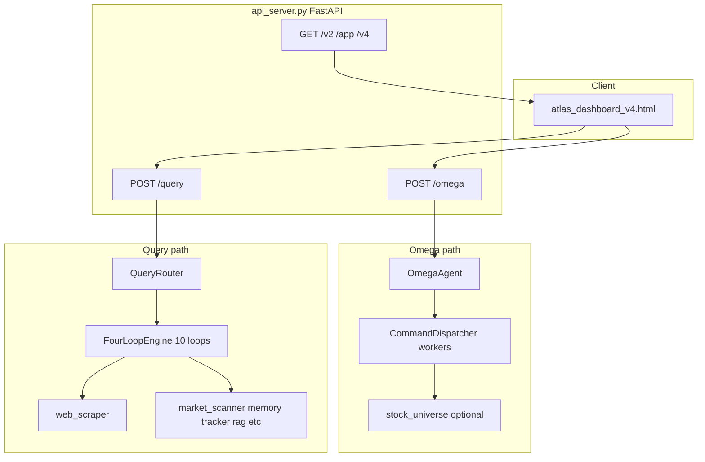

# ATLAS — Full Agent & Codebase Audit

**Document purpose:** Top-to-bottom technical and product breakdown of the ATLAS (“Context-Aware Algorithmic Research Agent”) system as implemented in this repository, plus an **opinionated** view on who it serves and how it might be valued.  

**Disclaimer:** Nothing here is investment, legal, or M&A advice. Valuation ranges are illustrative scenarios based on typical software / fintech precedents, not a formal appraisal.

---

## 1. Executive summary

ATLAS is a **Python-first research stack** that combines:

- **Deterministic data collection** (scraping, yfinance, SEC, feeds, optional Playwright, etc.)
- **Structured LLM synthesis** (Google Gemini, rate-limited via `gemini_limiter.py`)
- **Two main “brains”** exposed over HTTP:
  - **`OmegaAgent`** (`atlas_omega.py`) — fast, cross-domain “financial co-pilot” (stocks, macro, car loans, debt, etc.).
  - **`QueryRouter` / `FourLoopEngine`** (`query_router.py`) — **deeper equity/options pipeline** with **10 sequential loops** (scrape → audit → personalize → execution rules → scenarios → memory → adversarial → narrative).

The default **web UI** is a static **single-page dashboard** (`atlas_dashboard_v4.html` preferred, served by FastAPI at `/v2` / `/app`). A **legacy research dashboard** (`dashboard_server.py`, port **8765**) aggregates portfolio/regime state and can serve the same HTML.

**Core design principle (correct and valuable):** *Code fetches and normalizes; the model reasons over structured context.* That separates ATLAS from “chat-only” tools that hallucinate prices.

---

## 2. Who it is for

| Segment | Fit |
|--------|-----|
| **Serious retail trader / options user** | Strong — `/query`, options context parsing, scraper-backed context. |
| **“Whole finance” consumer** | Strong — `/omega` domains: car buying, debt, savings, retirement-ish framing. |
| **RIA / small desk (today)** | Partial — no multi-tenant auth, compliance archive, or audited execution chain out of the box. |
| **Institutional terminal replacement** | Not yet — data relies on free/public sources; quotas, ToS, and completeness are risks. |

---

## 3. How you run it (surfaces)

| Entry | Role |
|-------|------|
| **`python api_server.py`** | FastAPI on **8000**: `POST /omega`, `POST /query`, `GET /health`, positions/watchlist, **`GET /v2`** → dashboard. |
| **`python dashboard_server.py`** | Static **8765**: legacy `dashboard.html` + state API + Financial UI at `/v2`. |
| **`START_ATLAS.py`** | Launches `auto_bot.py --watch` + `dashboard_server.py`, opens browser to 8765. |
| **`auto_bot.py`** | Scheduling / intraday bot, ties into scanners and HTML outputs (separate from the “agent chat” UX). |
| **CLI research** | `deep_research.py`, `stock_universe.py`, various `python module.py` entry points. |

---

## 4. Architecture — top to bottom

### 4.1 `POST /omega` — OmegaAgent

**File:** `atlas_omega.py`

**Flow:**

1. **`IntentClassifier`** — regex/scoring bucket: `STOCK_RESEARCH`, `MACRO_RESEARCH`, `CAR_BUYING`, `HOME_BUYING`, `CRYPTO_ANALYSIS`, `GENERAL_FINANCE`, etc. Extracts tickers, credit score, location, option strike/expiry, budgets where possible.
2. **`CommandDispatcher.execute`** — builds a **task graph** (ThreadPoolExecutor): yfinance snapshots, RSS headlines, macro (VIX, SPX, yields), crypto (CoinGecko), geocoding + Overpass for dealers/banks, SEC filing indices for equities, etc.
3. **Discovery / allocation questions** — `_thematic_symbols_for_query()` may call **`stock_universe.run_progressive_scan(..., skip_deep_rank=True)`** to pull a **live filtered symbol list** (Finviz funnel + yfinance), then append benchmarks (`SPY`, `QQQ`, `IWM`). On failure, falls back to curated theme lists.
4. **`_synthesize`** — **one primary Gemini JSON call** (plus retry path) with instructions to use **only numbers present in DATA**; optional extra prompt block when many `market_*` keys exist (multi-name compare, sample allocation).
5. **Response** — nested/normalized fields consumed by dashboards (`headline`, `executive_brief`, `scenarios`, etc.). `api_server` may run `_normalize_omega_response`.

**What it is good at:** Speed, breadth across **non-equity** topics, consistent JSON report shape for the UI.

**What it is not:** The full **10-loop** equity dossier with `trader_memo` / `tldr` at the top level of the HTTP envelope (those come from `/query`).

---

### 4.2 `POST /query` — QueryRouter & FourLoopEngine (10 loops)

**File:** `query_router.py`

**Parse:** `QueryParser` → `ParsedQuery` (`query_type`, `tickers`, `options_context`, `budget`, `urgency`, …).

**Loops (as implemented in `run()`):**

| Loop | Name (conceptual) | What it does | AI? |
|------|-------------------|--------------|-----|
| **1** | Scrape / awareness | `web_scraper.gather_all` for tickers; macro/ETF paths; `market_scanner.full_awareness`; thematic path uses `_omega_thematic_symbols` / scrapes | No |
| **2** | Fact-check pass | UNVERIFIED tagging on text; merges scanner context | No |
| **3** | Synthesize | Big Gemini JSON: rating, trade plan, options_play, catalysts, risks, etc. | Yes |
| **4** | Audit | Second Gemini macro block + Python fixes (stop/target vs entry sanity) | Yes + Py |
| **5** | Personalize | Reads `positions_cache.json`, `atlas_tracker.db`, `paper_trades.json`; notes open positions | No |
| **6** | Execution rules | Price-based rules; optional hook into `alerts.py` | No |
| **7** | Scenarios / EV | Completes probabilities if missing; computes `_ev_pct` heuristics | Conditional AI |
| **8** | Regime memory | SQLite history on ticker + rating cohort + `atlas_memory.db` snippets | No |
| **9** | Adversarial | **Mechanistic** `failure_modes` + resilience — conditional on query type/rating | Conditional AI |
| **10** | Narrative | `trader_memo`, `hedge_fund_brief`, `tldr` | Yes |

**Return shape (important):** Top-level keys include `query`, `parsed_query`, `final_report`, **`tldr`**, **`trader_memo`**, `hedge_fund_brief`, `execution_rules`, `failure_modes`, `scenarios`, `audit_notes`, **`loop_outputs`** (full intermediate JSON), `timing`.

**Integration note:** `query_router` imports `_thematic_symbols_for_query` from `atlas_omega` for thematic discovery seeding, so **Omega and Query share discovery vocabulary**.

---

### 4.3 Progressive universe — `stock_universe.py`

**Role:** Free **funnel**: Finviz HTML screener (themed URLs) → parallel **yfinance** health filter → **signal** scoring → optional **`multi_ranker` / deep rank** (pass 4).

**Omega** typically uses **passes 1–3 only** (`skip_deep_rank=True`) to avoid doubling cost before its own Gemini synthesis.

**Risks:** Scraping Finviz (and similar) is subject to **HTML changes**, **blocking**, and **terms of use**. Production systems often pay for licensed market data.

---

### 4.4 Deep research CLI / API — `deep_research.py` & `POST /research/{ticker}`

**`deep_research.py`:** Large hybrid pipeline: scrape blob → Gemini structured output; used for heavy ticker work and discovery CLI.

**API:** `POST /research/{ticker}` tries `deep_research.research_ticker`; falls back to Omega query.

---

### 4.5 Data & intelligence modules (supporting cast)

| Module | Role |
|--------|------|
| **`web_scraper.py`** | Core omnivore: Finviz, news, SEC, many sites; feeds context text. |
| **`market_scanner.py`** | Regime, squeeze-style metrics, `full_awareness`, `get_market_regime`. |
| **`memory.py`** | Long-lived ticker memory (SQLite-backed patterns in router). |
| **`tracker.py`** | Recommendation history, P&amp;L fields used in loops 5 &amp; 8. |
| **`volume_profile.py`** | POC/VAH/VAL style context in synthesis satellite block. |
| **`sector_tracker.py`** | Sector “wind” / rotation context. |
| **`congress_tracker.py`** | Congressional trade disclosures context. |
| **`rag_engine.py`** | SEC / document RAG (optional; chromadb commented in requirements). |
| **`multi_ranker.py`** | Deeper scoring for universe pass 4. |
| **`options_simulator.py`** | P/L and options logic where wired. |
| **`delta_reporter.py`** | HTML delta reports under `reports/`. |
| **`paper_trader.py` / `broker_alpaca.py` / `broker_tradier.py`** | Paper/live broker integrations (feature surface for automation). |
| **`alerts.py`** | Price / notification alerts; desktop hooks guarded. |
| **`news_scanner.py` / `screen_watcher.py`** | Background monitoring utilities. |
| **`gemini_limiter.py`** | Global spacing + burst control for Gemini calls. |

---

### 4.6 Dashboard server — `dashboard_server.py`

**Role:** Serves **`dashboard.html`**, JSON **`/state`**, manual **`/refresh`**, research kick **`/research`**, static report paths, and **`/v2`** financial UI (v4-first).  

**Does not replace** the Gemini agent; it’s an **operations cockpit** tied to local files and modules.

---

## 5. State, databases, and files

| Artifact | Purpose |
|----------|---------|
| **`positions_cache.json`** | Manual positions for personalization loop. |
| **`watchlist.json`** | Watchlist API backing store. |
| **`paper_trades.json`** | Paper trades for loop 5 context. |
| **`atlas_tracker.db`** | Historical recommendations / P&amp;L fields. |
| **`atlas_memory.db`** | Persistent “memories” for loop 8 / memory module. |
| **`dashboard_state.json`** | Cached aggregated dashboard state. |
| **`reports/*.html`** | Generated research reports. |

**Moat thesis (from your roadmap):** The more real outcomes you log into `tracker` + `memory`, the more **Loop 8** differentiates from generic ChatGPT. This is **only true if usage is disciplined** (accurate logging, bias control).

---

## 6. Strengths (technical)

1. **Correct split of labor** between fetchers and LLM.  
2. **Two products in one repo:** quick universal agent (**Omega**) + **deep equity** pipeline (**Query**).  
3. **Honest rate limiting** (`gemini_limiter`) — reduces runaway spend and 429s in multi-threaded apps.  
4. **Progressive scanner** without paid API — great for prototyping and personal use.  
5. **10-loop router** is a **credible architecture** for institutional-style outputs *if* data quality and compliance are addressed.

---

## 7. Gaps & risks (honest)

1. **Compliance / disclaimers:** Not a registered RIA output; retail-facing claims need legal review.  
2. **Data licensing & ToS:** Finviz scrape, Reddit, etc. may be fragile or restricted at scale.  
3. **Auth / multi-tenant / billing:** Not present as a production SaaS.  
4. **Testing & CI:** Limited automated regression on scrapers and LLM JSON.  
5. **Operational maturity:** Long `POST /query` runs; timeouts and partial failures need UX and idempotent jobs.  
6. **Doc drift:** `api_server` header still says “4-loop” in places; implementation is 10-loop for `query_router`.

---

## 8. Valuation & “what it could sell for” (opinion only)

Valuation is **not** “lines of code × multiplier.” Buyers pay for **(a)** defensible distribution, **(b)** recurring revenue with churn under control, **(c)** clean IP/data posture, **(d)** team/velocity.

### 8.1 Today — “code + working local prototype”

If sold **as an asset sale** (IP + codebase, no meaningful ARR):

- **Rough order of magnitude:** low **five figures to low six figures USD** to a niche buyer (prop shop tooling tinkerer, indie publisher, acquihire scenario).  
- Upper end requires a **polished demo**, clean repo, **clear data ToS story**, and a **narrow wedge** (e.g. “options journal + research”).

### 8.2 Near-term — small SaaS ($5k–$50k MRR)

With **paying users**, supportable infra, and basic compliance packaging:

- Often talked about as a multiple of **ARR** (highly variable for small fintech).  
- **Illustrative:** $300k–$1.5M ARR might map to **~2–5× ARR** in optimistic private comps *if* growth + retention justify it (many don’t).

### 8.3 Later — “strategic” sale

Large strategic acquisitions in fintech/data are usually tied to **mass distribution** or **unique licensed data**, not a local Python monolith alone.

- **Illustrative ceiling stories** (e.g. $50M+): typically require **years** of traction, team, legal, and often **enterprise contracts**.

### 8.4 What would increase value fastest

1. **Pick one wedge** (e.g. options journal + research OR RIA copilot OR screener SaaS) — avoid “Bloomberg in a garage.”  
2. **Replace fragile scrapes** with licensed feeds for anything you sell B2B.  
3. **Ship auth + billing + audit log** for anything customer-facing.  
4. **Prove retention** (weekly active research sessions, saved reports, outcomes logged).

---

## 9. Suggested reading order (for a new engineer)

1. `api_server.py` — routes and what calls what.  
2. `atlas_omega.py` — Omega end-to-end.  
3. `query_router.py` — `FourLoopEngine.run()` and loop methods.  
4. `stock_universe.py` — progressive funnel.  
5. `web_scraper.py` + `market_scanner.py` — where facts come from.  
6. `atlas_dashboard_v4.html` — UX contract with API.  
7. `deep_research.py` — alternative deep path.  
8. `dashboard_server.py` — parallel “live state” product surface.

---

## 10. Summary verdict

ATLAS is an **ambitious, unusually complete solo/lean-team build**: real data plumbing, dual agents, progressive screening, and a structured multi-loop equity brain. Its **technical ceiling** is high if paired with **distribution, compliance, and licensed data**.  

As a **standalone codebase without traction**, treat it as **high-quality prototype IP**. As a **business**, value is dominated by **users and revenue**, not by agent sophistication alone.

---

*Generated audit reflects repository layout and module roles as of document creation; re-run a diff against `query_router.py` / `api_server.py` after major refactors.*
